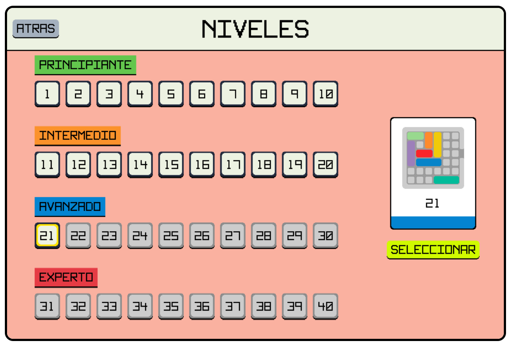
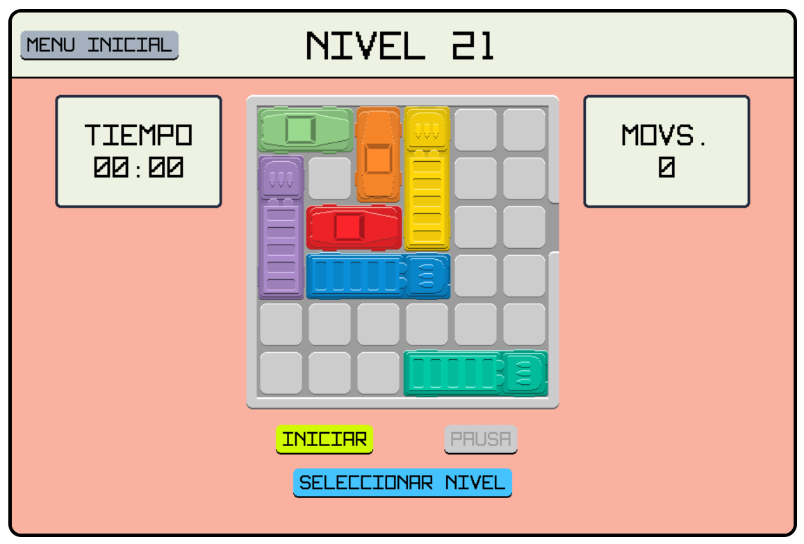

# Rush Hour Game

Adaptación a un videojuego web del [juego de mesa](https://www.thinkfun.com/products/rush-hour/) con el mismo nombre. El juego consiste en mover los distintos carros en el tablero, con el objetivo de liberar la salida para sacar el carro principal (de color rojo). El videojuego está desarrollado con tecnologías web, teniendo como herramienta principal la librería KaboomJS.

## Tecnologías usadas
### Frameworks y librerías

- [KaboomJS](https://kaboomjs.com/)

### Automatizadores

- [Vite](https://vitejs.dev/)

## Getting started

1. `git clone https://github.com/HDMC3/rush-hour-game.git`
2. `cd rush-hour-game`
3. `npm install`
4. `npm run dev`